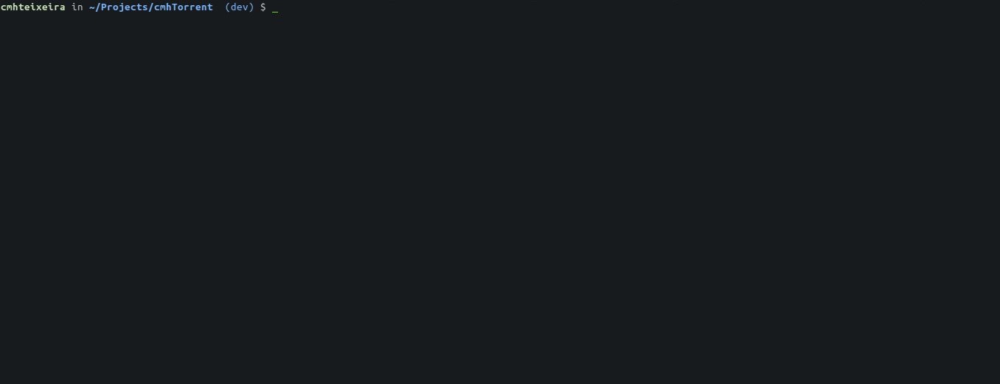

# Bittorrent client

## Core module

- Contains all the logic.
- Minimal external dependencies. 
- No concurrency library (**no** actors, cats-effects, vertx, reactive-streams, or the like)
 - Networking and concurrency from JVM/Java standard library.

## Cli

- REPL tool.
- Using [jline3](https://github.com/jline/jline3)

